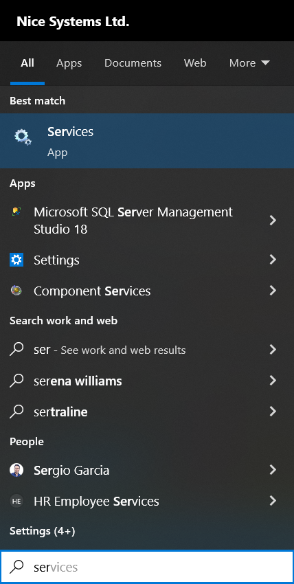
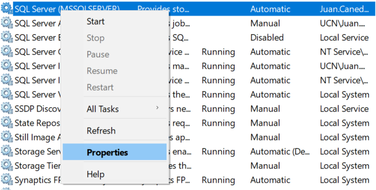
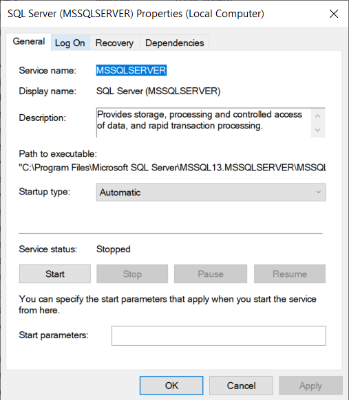
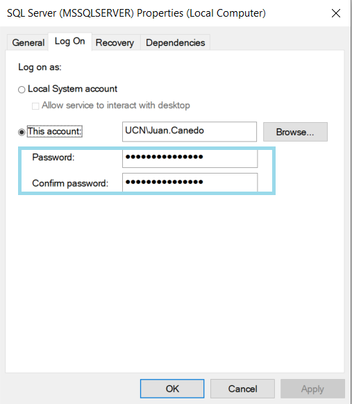

# [Troubleshooting IssueMSSM](./README.md)

If you have some issues when you try to start and connect to Server in your Microsoft SQL Server Management Studio as in the image:

You must follow the next steps:
1. In the search engine located on the lower left side next to the windows icon seek "Services" and press this application 

    

2. Find the SQL Server (MSSQLSERVER) service and right-click and select properties

    

    

3. Try first pressing the Start button and if the service does not run, move on and press the "Log On" button

    

4. In the emergent window please insert your account name and your password and applies these changes 

    

    

5. Go again to the general part and press the start button, The service must work again

    
